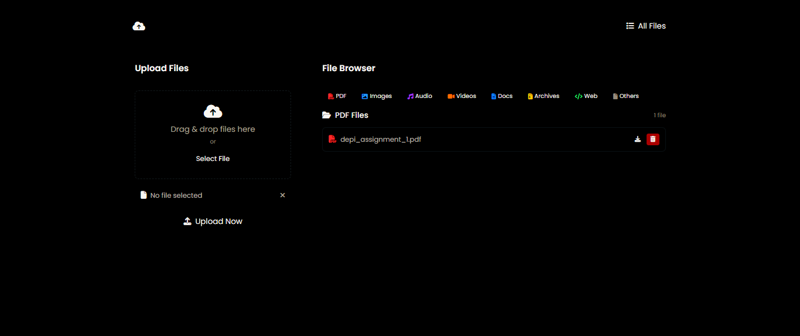
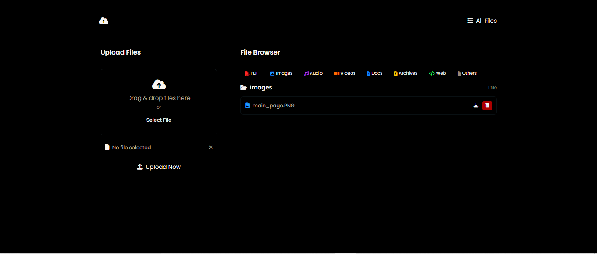
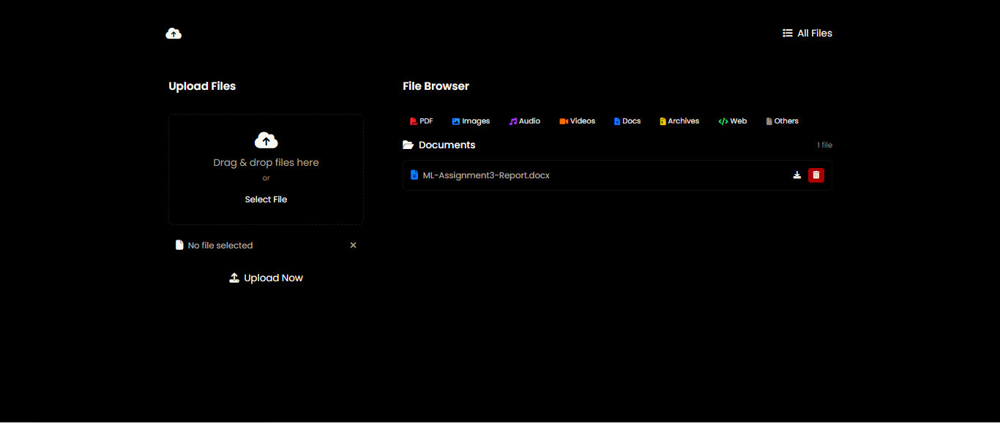

# FileSharing tool

A modern, user-friendly web application for uploading, browsing, downloading, and deleting files, powered by Flask.

---

## Features

- **Drag & Drop File Upload**
- **Category Browsing** (PDFs, Images, Audio, Videos, Documents, Archives, Web Files, Others)
- **Download & Delete Files**
- **Responsive UI** (Tailwind CSS, Font Awesome)
- **Local or S3 Storage** (configurable)

---

## Demo

[▶️ Watch the Demo Video on Google Drive](https://drive.google.com/file/d/1enLu2fE_hrCS6RH1p5p4osS60gMrY_TZ/view?usp=drive_link)

---

## Screenshots

**Main Page**  


**All Files**  


**PDFs**  


**Images**  


**Documents**  


---

## Getting Started

### Prerequisites

- Python 3.8+
- Flask (`pip install flask`)
- (Optional) AWS credentials if using S3

### Installation

1. **Clone the repository:**
    ```bash
    git clone https://github.com/yourusername/File-Handling-Tool.git
    cd File-Handling-Tool
    ```

2. **Install dependencies:**
    ```bash
    pip install -r requirements.txt
    ```

3. **(Optional) Configure AWS S3:**
    - Set your bucket name and credentials in `app.py` if you want to use S3.

4. **Run the app:**
    ```bash
    python app.py
    ```

5. **Open in your browser:**
    - Visit [http://localhost:5000](http://localhost:5000)

---

## Usage

- **Upload:** Drag and drop or select a file, then click "Upload Now".
- **Browse:** Use category buttons or "All Files" to view uploaded files.
- **Download:** Click the download icon next to any file.
- **Delete:** Click the trash icon and confirm deletion.

---

## Project Structure

```
File-Handling-Tool/
│
├── app.py
├── requirements.txt
├── templates/
│   └── upload.html
├── styles.css
├── screen-shots/
│   ├── all files.PNG
│   ├── docs.PNG
│   ├── images.PNG
│   ├── main page.PNG
│   └── pdfs.PNG
└── README.md
```

---

## License

MIT License

---

**Made with ❤️ by [Your Name](https://github.com/yourusername)**
